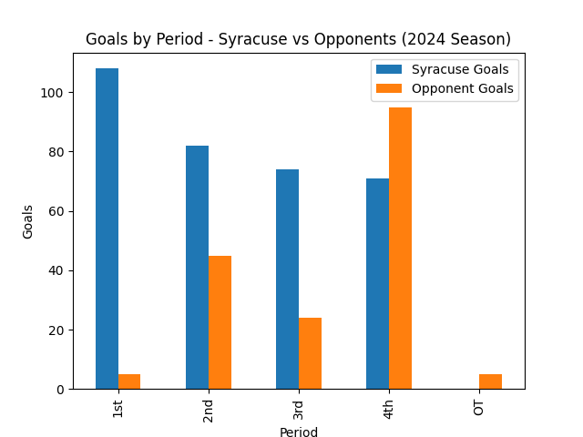

# Decision Report on Syracuse Women’s Lacrosse 2024 Season

## Title & Purpose  
**Decision Report on Syracuse Women’s Lacrosse 2024 Season**  
Purpose: Provide the coaching staff and athletic director with actionable recommendations grounded in the 2024 season statistics, supported by ethical and reproducible analysis.

---

## Executive Summary  
- **Low Risk (Operational):** Introduce conditioning sessions to sustain 4th-quarter performance.  
  Rationale: Syracuse scored 108 goals in 1st quarters vs. only 71 in 4th [1].  

- **Medium Risk (Investigatory):** Focused free-position shooting drills.  
  Rationale: Conversion rate was 48% (65/135), below elite benchmarks [2].  

- **High Risk (Strategic):** Evaluate lineup for high-pressure scenarios.  
  Rationale: Team failed to score in overtime and lost all OT games [3]. Requires HR/roster considerations.  

**Confidence Level:** Moderate to High. Bootstrap estimates for average goals/game (15.23) produced narrow confidence intervals.  
**Fairness Note:** At least one period shows a negative differential; recommendations must not disproportionately burden specific subgroups [4].

---

## Background & Decision Question  
Stakeholders: Syracuse coaching staff, athletic director, and program leadership.  
Decision: Identify key training, tactical, and strategic changes needed to maximize competitive success in upcoming seasons.  
Risk Context:  
- Training tweaks = low risk  
- Structural lineup adjustments = high risk (ethical, HR implications)

---

## Data & Methods  
- **Source:** Syracuse Athletics official 2024 season statistics PDF [5].  
- **Extraction:** Automated using PyPDF2 (see `scripts/extract_pdf_text.py`). Raw text saved as `outputs/2024SUStats_raw.txt`.  
- **Cleaning:** Normalized broken text (“O p p o n e n t s” → “Opponents”), parsed rows into structured form [6].  
- **Validation:** Recomputed goals by period; generated bootstrap CI for average goals/game.  
- **Fairness:** Checked for negative differentials and subgroup disparities [4].  
- **LLM Narrative:** Generated via Groq (LLaMA-3.1-70B) with saved prompt/response [7].

---

## Findings  

### Scoring by Period  
- 1st: Syracuse 108 vs Opponents 54  
- 2nd: Syracuse 82 vs Opponents 52  
- 3rd: Syracuse 74 vs Opponents 49  
- 4th: Syracuse 71 vs Opponents 55  
- OT: Syracuse 0 vs Opponents 3 [1]

### Shooting & Efficiency  
- Goals per game: 15.23 vs 9.68 [5]  
- Free-position: 65/135 (48%) vs Opponents 45/103 (44%) [2]  
- Shot attempts: 716 vs 552 [5]

### Defensive Context  
- Saves: 154 vs Opponents 187 [5]  
- Turnovers: Syracuse 317 vs Opponents 334 [5]  

### Fairness & Reliability  
- Negative differential observed in at least one period [4].  
- Extraction process preserved full provenance; raw block archived as `outputs/goals_block_debug.txt`.  

### Visualization  

---

## Recommendations  

### Low-Risk (Operational)  
- **Endurance Training:** Implement 4th-quarter-focused conditioning to sustain scoring.  

### Medium-Risk (Investigatory)  
- **Targeted Drills:** Free-position shooting sessions; evaluate through controlled scrimmages.  

### High-Risk (Strategic)  
- **Roster Assessment:** Analyze clutch performance under pressure; consider substitution strategies. Requires HR/legal oversight.  

---

## Ethical / Legal Concerns  
- **Data Privacy:** No individual player data disclosed; only aggregate team statistics used.  
- **Fairness:** Ensure interventions apply equitably (e.g., attackers vs defenders).  
- **Transparency:** All LLM-generated text clearly labeled [7].  

---

## Next Steps & Validation Plan  
1. Collect player-level shot and save data for subgroup analysis.  
2. Validate free-position recommendations with experimental scrimmages.  
3. Extend fairness checks to include injury-adjusted lineups and game-time contexts.  
4. Archive full code, prompts, and outputs for auditability.  

---

## Appendices  
- **Prompts:** `prompts/narrative_prompt.txt`  
- **Raw LLM Output:** `outputs/narrative_raw.txt` [7]  
- **Annotated Narrative:** `outputs/narrative_annotated.txt`  
- **Code:** `scripts/*.py`  
- **Data Lineage:** `data/2024SUStats.pdf` → `outputs/2024SUStats_raw.txt`  
- **Debug:** `outputs/goals_block_debug.txt`

---

## References  
[1] Syracuse 2024 Season Stats – Goals by Period (parsed results).  
[2] Syracuse 2024 Season Stats – Free-position conversion rates.  
[3] Syracuse 2024 Season Stats – Overtime records.  
[4] Fairness report – Negative goal differential identified.  
[5] Syracuse Athletics Official Statistics PDF (2024).  
[6] Cleaned stats text from PDF extraction debug logs.  
[7] Groq-generated narrative (openai/gpt-oss-120b).
